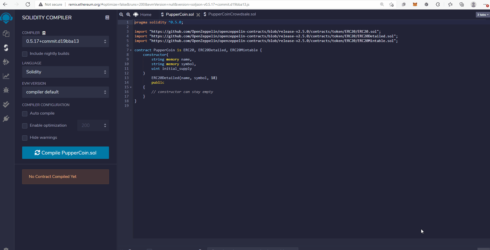

# PupperCoin:  You sure can attract a crowd!

## Background

In this project, an ERC20 token was created that will be minted through a Crowdsale contract that was leveraged from the OpenZeppelin Solidity library.

This crowdsale contract will manage the entire process, allowing users to send ETH and get back PUP (PupperCoin).  This contract will mint the tokens automatically and distribute them to buyers in one transaction.
It will need to inherit Crowdsale, CappedCrowdsale, TimedCrowdsale, RefundableCrowdsale, and MintedCrowdsale.

The crowdsale will be conducted on the Kovan testnet in order to get a real-world pre-production test in.

PupperCoin.sol file creates a standard ERC20Mintable token. It uses an ERC20Detailed contract.

Crowdsale.sol file takes in the following parameters:

- rate - rate in TKNbits
- wallet - sale beneficiary
- goal - cap of the crowdsale
- openingTime - is set equal to now
- closingTime - is set equal to now + 24 weeks

## Testing the Crowdsale

### Compile the Contracts

